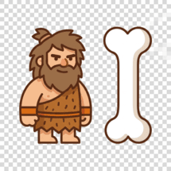

# Caveman.Mcp



**MCP (Model Context Protocol) server for [Caveman](https://github.com/francescopaolopassaro/caveman)** — exposes NLP token compression, language detection, content routing and summarization as MCP tools for Claude Code, OpenCode, Cursor, Windsurf, and any MCP-compatible agent.

> Part of the Caveman ecosystem: NLP prompt compressor for LLMs. Up to 70% token reduction, 50+ languages, zero ML models.

---

## Quick install — Claude Code

```json
{
  "mcpServers": {
    "caveman": {
      "command": "caveman-mcp"
    }
  }
}
```

Or with dotnet tool:

```bash
dotnet tool install --global Caveman.Mcp
```

---

## Tools

| Tool | Description |
|---|---|
| **compress** | Removes stop words and lemmatizes text. Up to 70% token reduction. |
| **detect_language** | Identifies language of any text. Returns ISO 639-3 code + confidence scores. |
| **route_content** | Auto-detects JSON, HTML, diff, log, code or prose and applies best algorithm. |
| **summarize** | Extractive summarization via TF-IDF or TextRank. |
| **compress_batch** | Compresses a list of texts in one call. |

---

## Usage

### compress

```
compress(text: "I would like to know if it is possible to receive information.", level: "semantic")
→ { "compressed": "know possible receive information", "efficiency_pct": 65.0, "energy_mwh": 0.05, "co2_mg": 0.02 }
```

### route_content

```
route_content(content: "[{\"name\":\"Alice\",\"age\":30}]", profile: "balanced")
→ { "compressed": "| name | age |\n| Alice | 30 |", "strategy": "JsonCrush:MarkdownTable", "savings_pct": 47.0 }
```

---

## Supported languages (50+)

Afrikaans · Arabic · Armenian · Basque · Bengali · Bulgarian · Catalan · Chinese · Croatian · Czech · Danish · Dutch · English · Estonian · Finnish · French · Galician · German · Greek · Hebrew · Hindi · Hungarian · Icelandic · Indonesian · Irish · Italian · Japanese · Kannada · Kazakh · Korean · Latin · Latvian · Lithuanian · Macedonian · Malay · Marathi · Norwegian · Persian · Polish · Portuguese · Romanian · Russian · Serbian · Slovak · Slovenian · Spanish · Swedish · Tamil · Telugu · Thai · Turkish · Ukrainian · Urdu · Vietnamese

---

## Links

- **Caveman core:** https://github.com/francescopaolopassaro/caveman
- **NuGet (core):** https://www.nuget.org/packages/Caveman
- **Python port (Synthelion):** https://pypi.org/project/synthelion/

© 2026 Passaro Francesco Paolo — Digitalsolutions.it
